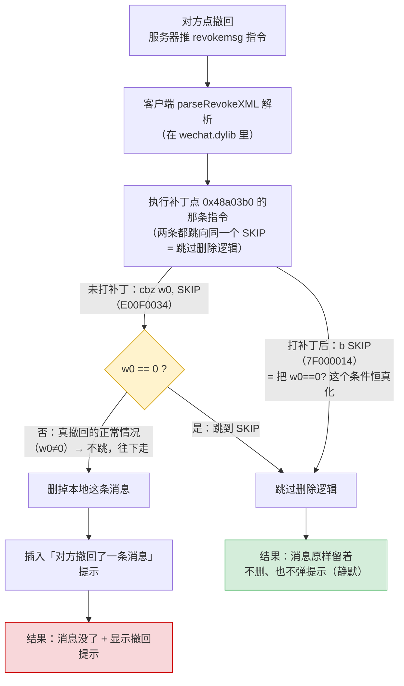

# 防撤回补丁改了什么

这个 fork 的实质改动 = 在 `wechat.dylib` 的 `parseRevokeXML` 入口翻转一条跳转指令。下图对比**未打补丁**和**打补丁后**同一条撤回指令走的两条路。

## 对照表

| | 未打补丁 | 打补丁后 |
|---|---|---|
| 那 4 个字节 | `E00F0034`（`cbz w0, SKIP`，条件跳转） | `7F000014`（`b SKIP`，无条件跳转） |
| 跳转目标 | SKIP（同一个地址） | SKIP（**目标不变**，只是变成必跳） |
| 撤回指令 | 照收照解析 | 照收照解析（没拦解析） |
| 删消息代码 | 正常会走到 | **永远走不到** |
| 你看到的 | 消息消失 + "对方撤回了一条消息" | 消息留着、无任何提示 |

## 三个关键点

- **只翻 4 个字节、原地等长替换**（`cbz` 和 `b` 都是 4 字节定长、目标偏移相同），不改二进制布局。
- **为什么只能「静默」**：补丁在最上游的解析器让客户端「当没看见这条撤回」，下游「删除 + 弹提示」整条流水线压根不触发——提示不是被关掉，是根本没被触发，所以也没地方挂高亮。
- **写入前有字节校验**：只有当 `0x48a03b0` 处原始字节确实是 `E00F0034` 才写；打错微信版本会报 `expectedMismatch` 拒写，不会盲写把微信弄坏。

> 地址/字节来自 `config.json`（4.1.11 build 269136 那条）与 `Sources/WeChatTweak/Patcher.swift` 的校验逻辑。
