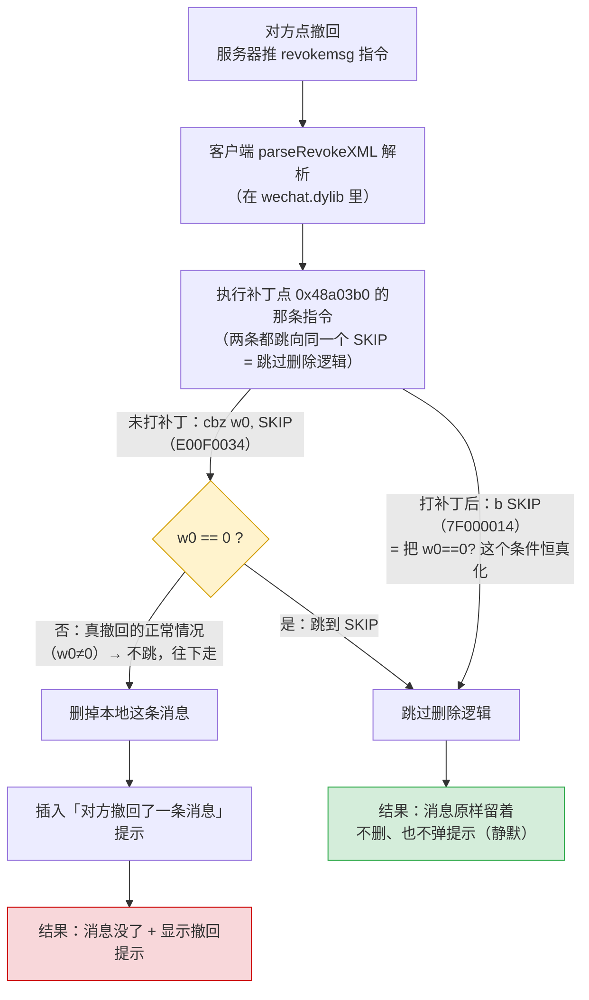
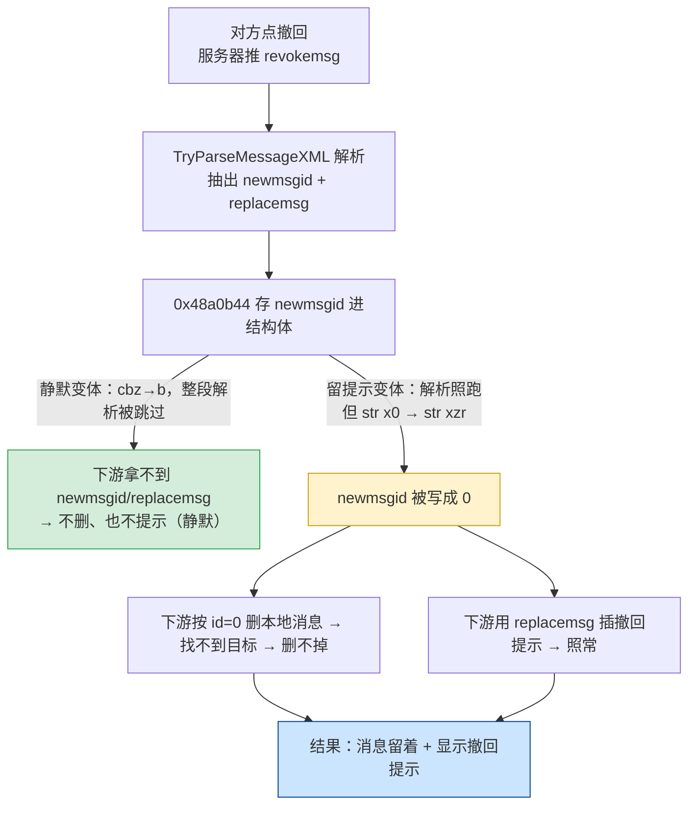

# 防撤回补丁改了什么

这个 fork 的实质改动 = 在 `wechat.dylib` 的 `parseRevokeXML` 入口翻转一条跳转指令。下图对比**未打补丁**和**打补丁后**同一条撤回指令走的两条路。

## 对照表

| | 未打补丁 | 打补丁后 |
|---|---|---|
| 那 4 个字节 | `E00F0034`（`cbz w0, SKIP`，条件跳转） | `7F000014`（`b SKIP`，无条件跳转） |
| 跳转目标 | SKIP（同一个地址） | SKIP（**目标不变**，只是变成必跳） |
| 撤回指令 | 照收照解析 | 照收照解析（没拦解析） |
| 删消息代码 | 正常会走到 | **永远走不到** |
| 你看到的 | 消息消失 + "对方撤回了一条消息" | 消息留着、无任何提示 |

## 三个关键点

- **只翻 4 个字节、原地等长替换**（`cbz` 和 `b` 都是 4 字节定长、目标偏移相同），不改二进制布局。
- **当前补丁为什么是「静默」的**：`b SKIP` 把整个撤回处理块（既含「删本地消息」也含「插入撤回提示」）一起跳过，所以消息留下、提示也不弹。这是**当前这个补丁点**的取舍，不是微信 4.x 的机制上限——换补丁点即可只跳删除、保留提示（见下节）。
- **写入前有字节校验**：只有当 `0x48a03b0` 处原始字节确实是 `E00F0034` 才写；打错微信版本会报 `expectedMismatch` 拒写，不会盲写把微信弄坏。

> 地址/字节来自 `config.json`（4.1.11 build 269136 那条）与 `Sources/WeChatTweak/Patcher.swift` 的校验逻辑。

## 「留提示」变体（`--variant keeptip`，已实现）

「消息保留 **且** 仍显示『对方撤回了一条消息』提示」已实现，用 `patch --variant keeptip` 打。做法与静默相反——不拦解析，而是**把 newmsgid 清零**让删除落空。

逆向已确认：`0x48a03b0` 的 `cbz` 守着的是撤回 XML **解析器**（`TryParseMessageXML`），解析器把 `newmsgid`（删哪条）、`replacemsg`（提示文本）抽进结构体，下游 consumer 再据此删消息 + 插提示。其中 `newmsgid` 在 `0x48a0b44` 处被存进结构体（`str x0,[x19,#0x168]`）。

两处等长字节改动（269136）：

| 补丁点 | 静默变体 | 留提示变体 |
|---|---|---|
| `0x48a03b0`（`cbz w0`） | `E00F0034` → `7F000014`（改 `b`，跳过解析） | `→ E00F0034`（恢复/保持 `cbz`，让解析照跑；expected 兼容已静默补丁的 `7F000014`） |
| `0x48a0b44`（`str x0,[x19,#0x168]`） | 不动 | `60B600F9` → `7FB600F9`（`str xzr`，把 newmsgid 写 0） |
| 「插入撤回提示」（下游） | 无输入，不触发 | 照常执行 |
| 「按 newmsgid 删本地消息」（下游） | 无输入，不触发 | 按 id=0 查无，删不掉 |
| 结果 | 消息留着、无提示 | 消息留着、有提示 |

**修正早前判断**：更早一度以为「留提示 = 定位并 NOP 掉下游那条删本地消息的调用」，并因该调用在虚派发/chained-fixup 接收侧、静态难定位而搁置——**方向错了**。正确做法不需要找到删除调用，只在 `newmsgid` 存入结构体的源头（`0x48a0b44`）清零即可。这条 `str x0`→`str xzr` 来自参考实现 [fzlzjerry/wechat-antirecall](https://github.com/fzlzjerry/wechat-antirecall) 的 `revoke-tip` 模式。

> **状态：已实现，build 269136（4.1.11）实机实测通过**——撤回后消息保留、且显示「对方撤回了一条消息」提示。静态复核：打补丁后 `0x48a03b0` = `cbz w0`、`0x48a0b44` = `str xzr`（objdump 核对），与 fzlzjerry `revoke-tip` 对 269110 的补丁逐字节同构。fzlzjerry 另有 `--runtime-tip` 用注入 dylib 自定义提示文案，本 fork 未纳入。
