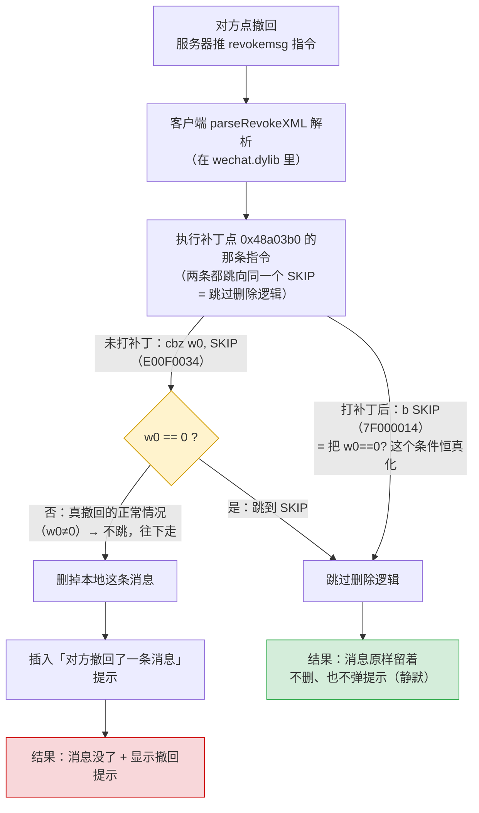

# 防撤回补丁改了什么

这个 fork 的实质改动 = 在 `wechat.dylib` 的 `parseRevokeXML` 入口翻转一条跳转指令。下图对比**未打补丁**和**打补丁后**同一条撤回指令走的两条路。

## 对照表

| | 未打补丁 | 打补丁后 |
|---|---|---|
| 那 4 个字节 | `E00F0034`（`cbz w0, SKIP`，条件跳转） | `7F000014`（`b SKIP`，无条件跳转） |
| 跳转目标 | SKIP（同一个地址） | SKIP（**目标不变**，只是变成必跳） |
| 撤回指令 | 照收照解析 | 照收照解析（没拦解析） |
| 删消息代码 | 正常会走到 | **永远走不到** |
| 你看到的 | 消息消失 + "对方撤回了一条消息" | 消息留着、无任何提示 |

## 三个关键点

- **只翻 4 个字节、原地等长替换**（`cbz` 和 `b` 都是 4 字节定长、目标偏移相同），不改二进制布局。
- **当前补丁为什么是「静默」的**：`b SKIP` 把整个撤回处理块（既含「删本地消息」也含「插入撤回提示」）一起跳过，所以消息留下、提示也不弹。这是**当前这个补丁点**的取舍，不是微信 4.x 的机制上限——换补丁点即可只跳删除、保留提示（见下节）。
- **写入前有字节校验**：只有当 `0x48a03b0` 处原始字节确实是 `E00F0034` 才写；打错微信版本会报 `expectedMismatch` 拒写，不会盲写把微信弄坏。

> 地址/字节来自 `config.json`（4.1.11 build 269136 那条）与 `Sources/WeChatTweak/Patcher.swift` 的校验逻辑。

## 「留提示」变体（开发中）

「消息保留 **且** 仍显示『对方撤回了一条消息』提示」在技术上可行，且**已有人做到**：见 [sunnyyoung/WeChatTweak issue #1038](https://github.com/sunnyyoung/WeChatTweak/issues/1038)，wuliyc 在微信 4.1.11（build 269136）上实现了消息保留 + 撤回提示照常。

逆向已确认：`0x48a03b0` 的 `cbz` 守着的是撤回 XML **解析器**（`TryParseMessageXML`），不是删除+提示本身。解析器把 `newmsgid`（删哪条）、`replacemsg`（提示文本）抽进结构体，下游的 consumer 再据此删消息 + 插提示。静默补丁跳过解析 → 下游拿不到输入 → 删除和提示一起不发生。

思路与静默补丁相反，分两步：

| | 静默变体（当前发布版） | 留提示变体（开发中） |
|---|---|---|
| 对 `0x48a03b0` 的 `cbz` | 改成 `b`，跳过撤回解析 | **恢复 `cbz`**，让解析照跑 |
| 下游拿到 `newmsgid`/`replacemsg` | 拿不到 | 拿得到 |
| 「插入撤回提示」（下游） | 无输入，不触发 | 照常执行 |
| 「按 newmsgid 删本地消息」（下游） | 无输入，不触发 | 单独 **NOP 掉那一条调用** |
| 结果 | 消息留着、无提示 | 消息留着、有提示 |

**难点（逆向已确认）**：「删本地消息」的调用**不在**解析函数 `0x48a0140` 内，而在消费解析结果的**下游函数**里——精确 VA 静态未定位，需 lldb 动态断点（跟 `newmsgid` 的消费栈）或 wuliyc 的具体字节。恢复 `cbz`（第①步）字节已知；NOP 点（第②步）待定。

> **状态：逆向中，尚未实现、尚未验证。** 已确认「补丁块 = XML 解析器、删除在下游」；下游删除补丁点待定位。不代表本 fork 已产出可用的「留提示」补丁。
