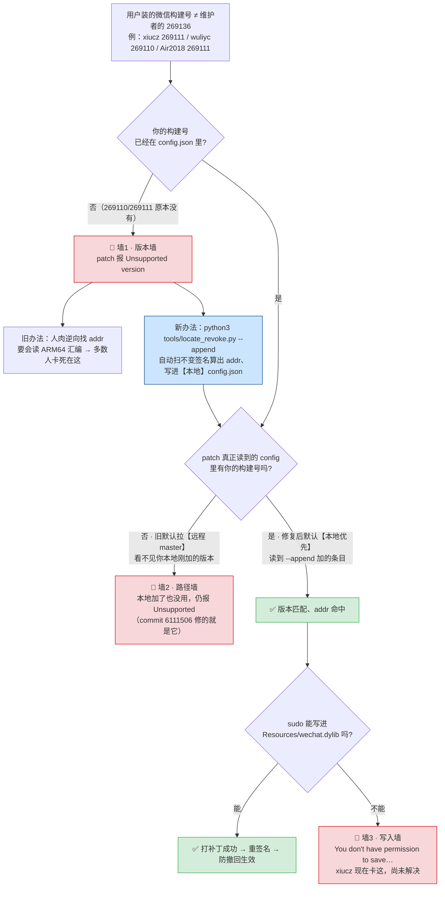

# issue #1038 里大家到底卡在哪

「版本和我不一样」的用户，在打补丁流程上会依次撞三堵墙。下图把每个人卡的位置画在同一条链上——注意**三堵墙是三个不同的问题**，别混为一谈。

## 三堵墙对照（差在哪、谁碰上、解没解）

| | 墙1 · 版本墙 | 墙2 · 路径墙 | 墙3 · 写入墙 |
|---|---|---|---|
| **报什么** | `Unsupported version` | `Unsupported version`（同报错、不同根因） | `You don't have permission to save "wechat.dylib"` |
| **根因** | 你的构建号地址全变、config 里没有它 | patch 默认去读**远程 master**，看不见你**本地** `--append` 加的版本 | sudo 下仍写不进 `/Applications` 里的 dylib（macOS 保护 / 文件标志之类） |
| **发生时机** | 一开始就撞（版本对不上） | 加了本地条目、以为该好了，却还报同样的错 | 版本已匹配、addr 已命中，倒在最后写入 |
| **谁碰上** | 所有非 269136 用户（xiucz/wuliyc/Air2018…） | 任何按 README「本地加条目」流程走的人 | xiucz（269111，版本已对） |
| **解了吗** | ✅ `locate_revoke.py` 自动定位，无需会汇编 | ✅ commit 6111506 改默认**本地优先**读 config | ❌ 独立问题，写入权限层，尚未定位根因 |

## 一句话总结

- 墙1、墙2 是**同一句报错的两个不同原因**，最容易被搅混——「我明明把地址加进去了怎么还 Unsupported」= 墙2，不是你 addr 抄错。两墙现在都通了。
- 墙3 是**另一层**（文件写入权限），跟版本、跟 config 路径都无关；xiucz 现在就卡这，需要单独查。

> 数据来源：269136 = 维护者构建（config.json）；269110 addr=450a128（wuliyc 逆向）、269111 addr=450a144（wh5a 跑 locate_revoke.py 所得），均见 issue #1038 评论。写入墙报错文本引自 xiucz 评论 5010657440。
